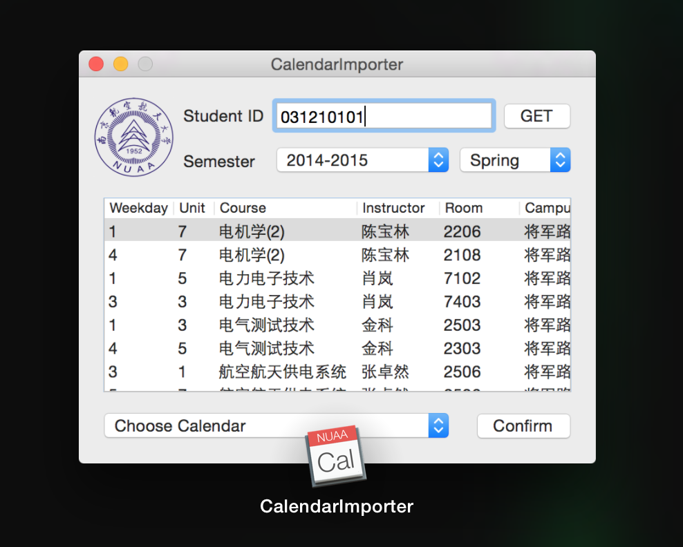
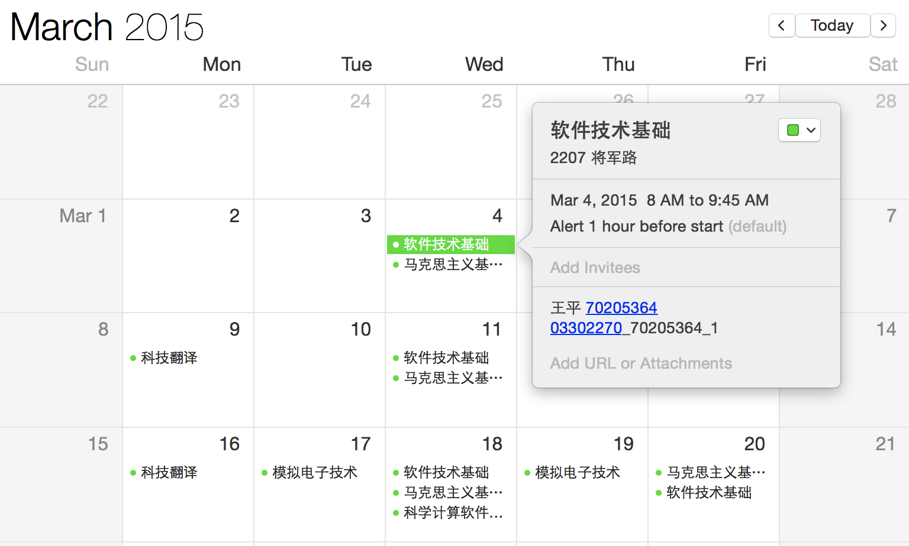

## NUAATimeTable

在Mac OS X下将南航课表导入到iCal。

[Download v0.2](https://bintray.com/artifact/download/c0r3d3v/NUAACalendarImporter/CalendarImporter.zip)
SHA1 98b11e247c36e016e4d23bbc0e57a40f588e2ea3

## Screenshots

## Requirements

- Xcode 6
- OS X 10.10

## Credits
感谢ljlin在开发过程中给予的帮助。